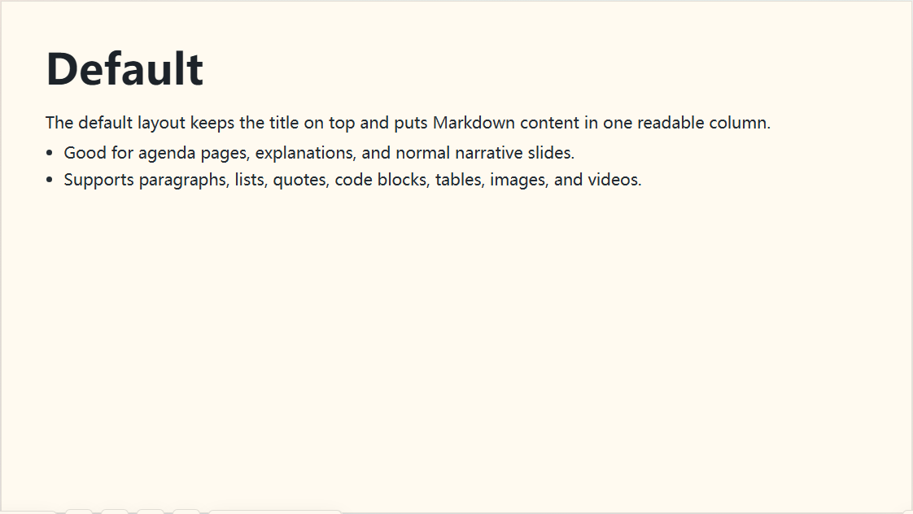
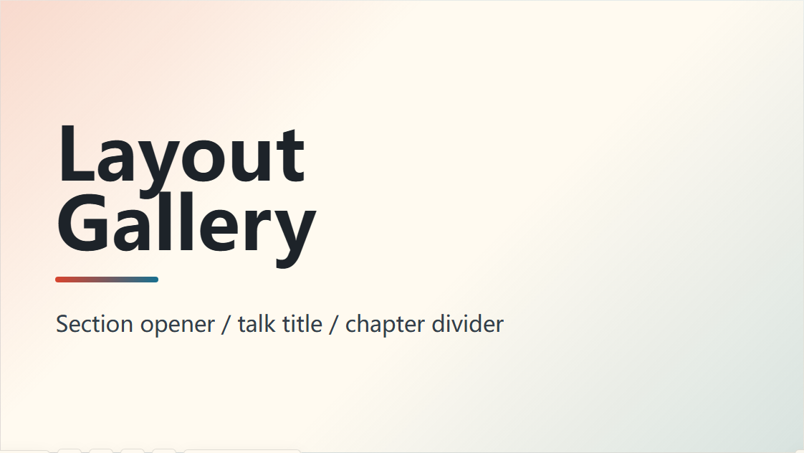
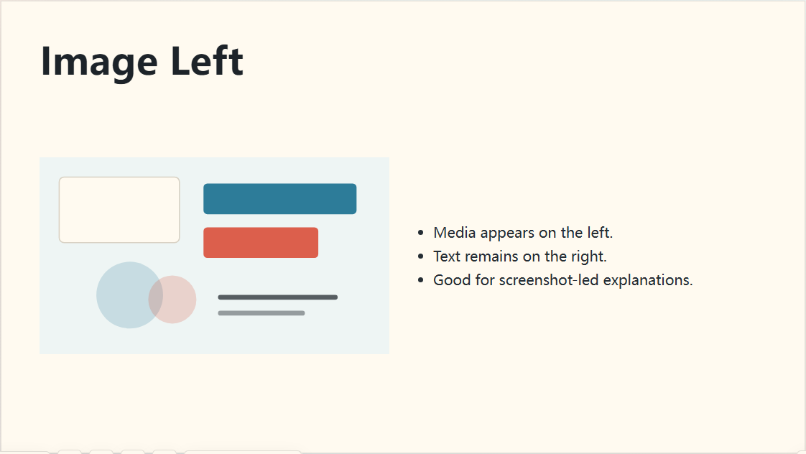
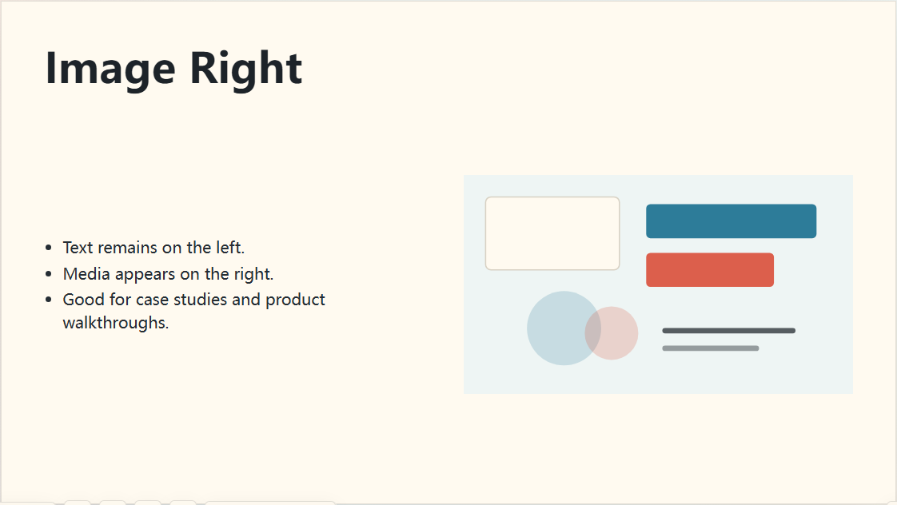
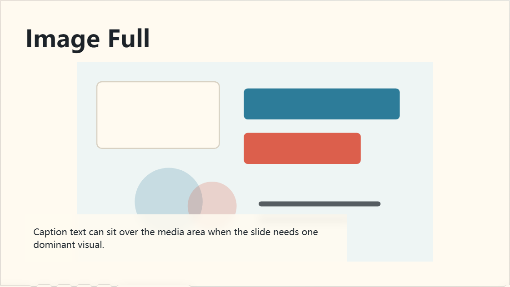
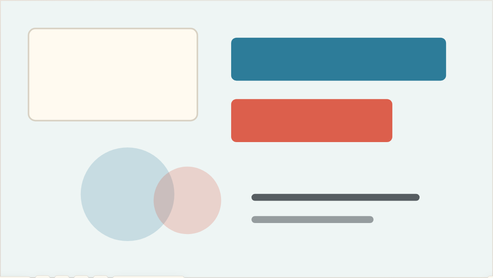
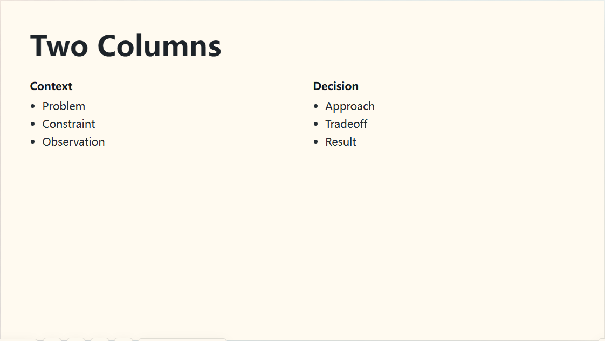
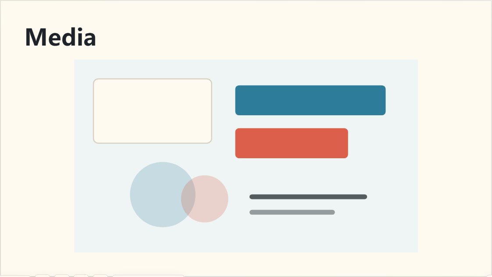
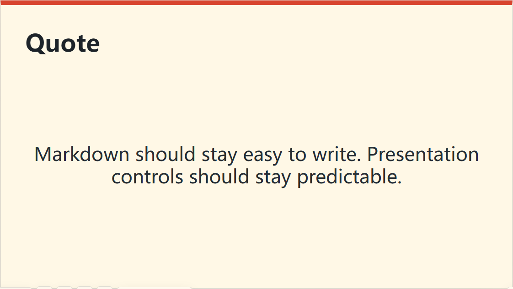
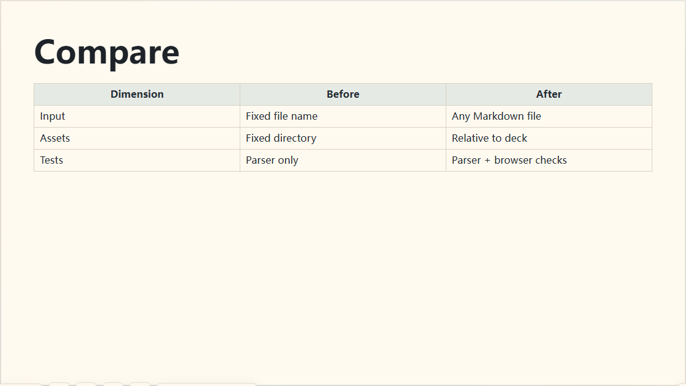

# MD2Slides

> Turn a plain Markdown file into a polished, offline-ready 16:9 slide deck — no slide editor required.

MD2Slides is a local Markdown-to-HTML slide tool. You write in ordinary Markdown; it parses your file during Vite `dev`, `preview`, or `build` and renders a clean 16:9 deck in the browser. The build output is fully static — open it offline, publish it to any web host, or print it to PDF straight from your browser.

It's built for quickly turning lectures, tutorials, and technical notes into presentable web slides, with just enough layout control to look intentional and none of the overhead of a slide app.

## Features

- **Write in plain Markdown** — `#` and `##` start new slides automatically; HTML-comment directives add optional layout, theme, and break control when you want it.
- **Ten built-in layouts** — `default`, `cover`, `image-left`, `image-right`, `image-full`, `full`, `two-col`, `media`, `quote`, and `compare` cover everything from section dividers to side-by-side comparisons.
- **Themes and type scales** — three themes (`light`, `dark`, `accent`) and four content sizes (`normal`, `large`, `xl`, `hero`) to set tone and emphasis per slide.
- **Content that always fits** — `fit=shrink` scales overflowing slides down, while `fit=scroll` keeps dense tables and reference material scrollable.
- **Smart asset copying** — only the local images and videos your deck actually references get copied into the build, with relative paths preserved.
- **The browser is the player** — keyboard navigation, overview mode, fullscreen, jump-to-slide, plus live theme and font panels.
- **Shareable deep links** — `#slide-3` opens the third slide directly, and settings like `?theme=dark` ride along in the URL.
- **Static, portable output** — build artifacts run offline anywhere and export cleanly to PDF via browser print.

---

## Quick Start

This is a JavaScript workspace. Install dependencies, then run a deck in development mode:

```powershell
npm install
npm run dev -- examples/tutorial.md
```

The `dev` command starts Vite, parses the Markdown file live, and hot-reloads the browser when you save changes.

Build a static deck:

```powershell
npm run build -- examples/tutorial.md
```

The `build` command writes the offline slide deck to `dist/` by default and copies any referenced local media assets.

Preview the built output:

```powershell
npm run preview -- examples/tutorial.md
```

You can deploy the generated `dist/` directory to any static host, or open `dist/index.html` directly in a browser.

## CLI Options

| Option | Commands | Default | Description |
| --- | --- | --- | --- |
| `dev` | - | - | Start the Vite development server and parse Markdown live. |
| `build` | - | - | Build static HTML output and copy referenced local assets. |
| `preview` | - | - | Serve the built output from `dist/`. |
| `[deck.md]` | `dev` / `build` / `preview` | `examples/basic.md` | Input Markdown file. Asset paths are resolved relative to this file. |
| `--title <title>` | `dev` / `build` | First slide title or `MD2Slides` | Override the browser title and deck title. |
| `--outDir <dir>` | `build` | `dist` | Build output directory. |
| `--host <host>` | `dev` / `preview` | `127.0.0.1` | Local server host. |
| `--port <port>` | `dev` / `preview` | Vite chooses automatically | Local server port. |
| `--open` | `dev` | Enabled | Open the browser after starting the dev server. |
| `--no-open` | `dev` | - | Do not open the browser automatically. |
| `-h`, `--help` | All commands | - | Show command help. |

You can also call the CLI directly:

```powershell
node ./bin/md2slides.js dev examples/basic.md --host 127.0.0.1 --port 5173 --no-open
node ./bin/md2slides.js build examples/layouts.md --outDir dist-layouts --title "Layout Gallery"
node ./bin/md2slides.js preview examples/layouts.md --host 127.0.0.1 --port 4173
```

To use `md2slides` from anywhere on your machine, link the package from the project root:

```powershell
npm link
md2slides dev F:\path\to\deck.md --no-open
```

---

## Presentation Controls

| Input | Action |
| --- | --- |
| `ArrowRight` / `Space` / `PageDown` | Next slide |
| `ArrowLeft` / `Backspace` / `PageUp` | Previous slide |
| `Home` | First slide |
| `End` | Last slide |
| `O` | Toggle overview mode |
| `F` | Request browser fullscreen |
| Slide number input | Enter a slide number and press Enter to jump |
| Theme panel | Override the deck with Auto / Light / Dark / Accent |
| Font panel | Switch font presets or enter a custom `font-family` |

URL hashes support deep links. For example, `#slide-3` opens slide 3 directly. Runtime settings can also be passed through query parameters such as `?theme=dark`, `?font=mono`, or `?fontFamily=...`.

---

## Markdown Rules

### Automatic Slide Breaks

`#` and `##` headings start new slides. `###` and deeper headings stay inside the current slide.

```md
# First Slide

This is the first slide.

### In-slide Heading

This still belongs to the first slide.

## Second Slide

This starts the second slide.
```

### Manual Slide Breaks

Use an HTML comment directive to force a new slide inside the current section:

```md
# AI Dungeon

First slide content.

<!-- slide: break -->

Second slide content that inherits the previous title.
```

Slide directives inside code blocks are treated as normal Markdown text and are not executed.

````md
```md
<!-- slide: break layout=quote -->
```
````

### Frontmatter

Deck-level options can be placed at the top of the Markdown file:

```md
---
font: cn-sans
fontFamily: ""
---

# First Slide
```

| Field | Default | Description |
| --- | --- | --- |
| `font` | `system` | Font preset. Supports `system`, `cn-sans`, `serif`, and `mono`. |
| `fontFamily` | Empty | Custom CSS `font-family`. Takes priority over `font` when present. |

---

## Slide Directives

Directive format:

```md
<!-- slide: [break] key=value key=value hidden -->
```

Full example:

```md
<!-- slide: break layout=image-right class=dark fit=scroll size=xl title="Custom Title" hidden -->
```

| Option | Values | Default | Description |
| --- | --- | --- | --- |
| `break` | Bare flag | - | Start a new slide at the current position and apply the following options to it. |
| `layout` | `default` / `image-left` / `image-right` / `image-full` / `full` / `two-col` / `media` / `cover` / `quote` / `compare` | `default` | Controls slide structure. |
| `class` | `light` / `dark` / `accent` | `light` | Controls slide theme. |
| `fit` | `shrink` / `scroll` | `shrink` | Controls overflow behavior. |
| `size` | `normal` / `large` / `xl` / `hero` | `normal` | Controls content text scale. |
| `title` | Any text | Current heading | Overrides the slide title. Use `<br>` for manual line breaks. |
| `hidden` | `hidden` / `hidden=true` / `hidden=false` | `false` | Hide the slide from the final deck. |

Without `break`, options apply to the current slide. With `break`, the current slide ends first, then a new slide is created.

---

## Layout Gallery

Preview images are generated from `examples/layouts.md` by running `npm run docs:previews`. Each image is a real screenshot of the player.

### `layout=default`

Standard title plus one-column body content. Good for most explanations, agendas, and transition slides.



```md
# Default

- Normal content
- Lists, quotes, code and tables
```

### `layout=cover`

Cover, chapter, or section divider slide with larger title styling.



```md
<!-- slide: layout=cover title="Layout<br>Gallery" -->

Section opener
```

### `layout=image-left`

The first image or video is placed on the left; remaining content is placed on the right.



```md
<!-- slide: layout=image-left -->


- Point one
- Point two
```

### `layout=image-right`

The first image or video is placed on the right; remaining content is placed on the left.



```md
<!-- slide: layout=image-right -->


- Point one
- Point two
```

### `layout=image-full`

The first image or video becomes the dominant visual, with text acting as a caption layer.



```md
<!-- slide: layout=image-full -->


Caption text
```

### `layout=full`

Hides the title and lets content fill the 16:9 canvas. Useful for full-page screenshots, videos, or a single large image.



```md
<!-- slide: layout=full -->


```

### `layout=two-col`

Splits body content into two columns. Use a standalone `---` line to separate the left and right sides clearly.



```md
<!-- slide: layout=two-col -->

Left column

---

Right column
```

### `layout=media`

Media-first layout. If a slide only has media, it fills the media area; if text is present, the slide becomes a media-plus-text layout.



```md
<!-- slide: layout=media -->


```

### `layout=quote`

Centers and enlarges the body copy. Good for key ideas, quotes, and one-sentence takeaways.



```md
<!-- slide: layout=quote class=accent -->

One strong sentence.
```

### `layout=compare`

Optimizes table sizing and spacing for comparisons, before/after changes, and decision matrices.



```md
<!-- slide: layout=compare -->

| Item | Before | After |
| --- | --- | --- |
| Input | Fixed | Flexible |
```

---

## Themes, Fitting, and Sizes

### Themes

| Directive | Effect |
| --- | --- |
| `class=light` | Default light slide theme. |
| `class=dark` | Dark stage for video, screenshots, or low-light presentations. |
| `class=accent` | Emphasis theme for quotes, transitions, or highlight slides. |

The player theme panel can temporarily override the whole deck. `Auto` restores per-slide `class=...` settings; `Light`, `Dark`, and `Accent` write the choice into the URL, such as `?theme=dark`.

### Content Fitting

| Directive | Effect |
| --- | --- |
| `fit=shrink` | Default. Content scales down when it overflows and marks overflow if it still cannot fit. |
| `fit=scroll` | Allows the body area to scroll. Useful for long tables or reference slides. |

### Text Sizes

| Directive | Effect |
| --- | --- |
| `size=normal` | Default body size. |
| `size=large` | Larger body copy for short lists. |
| `size=xl` | Larger again for agendas or a few key phrases. |
| `size=hero` | Very large body copy for one sentence or a number. |

---

## Fonts

MD2Slides provides four font presets that can be selected through frontmatter or the player font panel.

| Preset | Description |
| --- | --- |
| `system` | Default system sans-serif stack. |
| `cn-sans` | Chinese-first sans-serif stack. |
| `serif` | Serif stack for formal or reading-focused content. |
| `mono` | Monospace stack for code or technical decks. |

Use frontmatter:

```md
---
font: cn-sans
---
```

Or provide any custom CSS font stack:

```md
---
fontFamily: '"LXGW WenKai", "PingFang SC", sans-serif'
---
```

Custom `fontFamily` takes priority over the `font` preset.

---

## Asset Rules

Local asset paths are resolved relative to the Markdown file:

```md

<video src="assets/demo.mp4" controls></video>
```

During build, only local assets actually referenced by the Markdown deck are copied, and relative paths are preserved. Remote URLs, `data:`, and `blob:` sources are not copied.

Supported asset references include:

```md


<video src="media/c.mp4" controls preload="metadata"></video>
<source src="media/d.webm">
```

---

## Build, Preview, and PDF

Build a static deck:

```powershell
npm run build -- examples/layouts.md
```

Preview the final output locally:

```powershell
npm run preview -- examples/layouts.md
```

To export a PDF, open the preview URL in a browser and use print to save as PDF. Chrome or Edge work well with paper size set to A4 or a custom 16:9 size, and margins set to none.

---

## Layout Preview Images

Regenerate the preview images used by this README:

```powershell
npm run docs:previews
```

The script starts a local dev server, opens `examples/layouts.md`, and writes screenshots for each layout into `docs/layout-previews/`.

---

## Tests

```powershell
npm test
```

The test suite includes:

- Markdown parser unit tests.
- Asset reference parsing, validation, and copy tests.
- Playwright browser tests for rendering, keyboard navigation, controls, hash routing, overview mode, font controls, and layout DOM.

---

## Project Structure

```text
MD2Slides/
  bin/md2slides.js              CLI entry point
  src/core/parseDeck.js         Markdown parsing core
  src/node/                     Vite plugin, asset parsing, and copy logic
  src/app/                      Browser player and styles
  examples/basic.md             Minimal example deck
  examples/layouts.md           Layout gallery deck
  docs/layout-previews/         Layout preview images used by README
  scripts/captureLayoutPreviews.js
  test/                         Unit and Playwright tests
```

---

## Source Release Package

Create a distributable source zip:

```powershell
npm run release:zip
```

The script reads `name` from `package.json`, writes a `<name>-yyyyMMdd.zip` file into `releases/`, and includes source, tests, docs, examples, and README preview images. It excludes local generated directories such as `node_modules/`, `dist/`, `dist-*`, `test-results/`, `playwright-report/`, `.git/`, and `releases/`.
