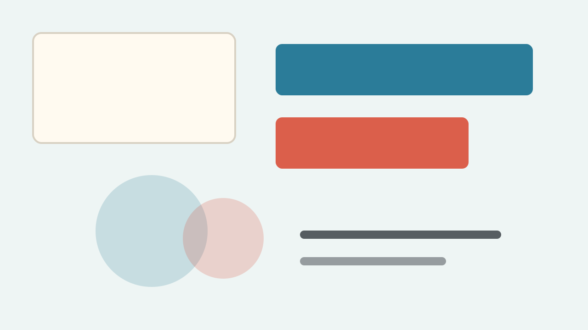

# MD2Slides

Turn Markdown into HTML slides that can be presented, opened offline, and printed to PDF.

- `#` and `##` start new slides
- `###` stays inside the current slide
- Images, videos, tables, quotes, and code blocks are supported

## Authoring Style

### A Small Heading Inside the Current Slide

> Keep Markdown readable, then use a few comment directives when a slide needs layout control.

```md
<!-- slide: break layout=quote -->
One sentence that deserves its own slide.
```

## Text and Image

<!-- slide: layout=image-right -->



- Media is placed in the visual area
- Text stays on the opposite side
- Useful for cases, workflows, and screenshots

<!-- slide: break layout=quote title="Keep It Simple" -->

Write the content first. Tune the slide layout only where it helps the audience.
