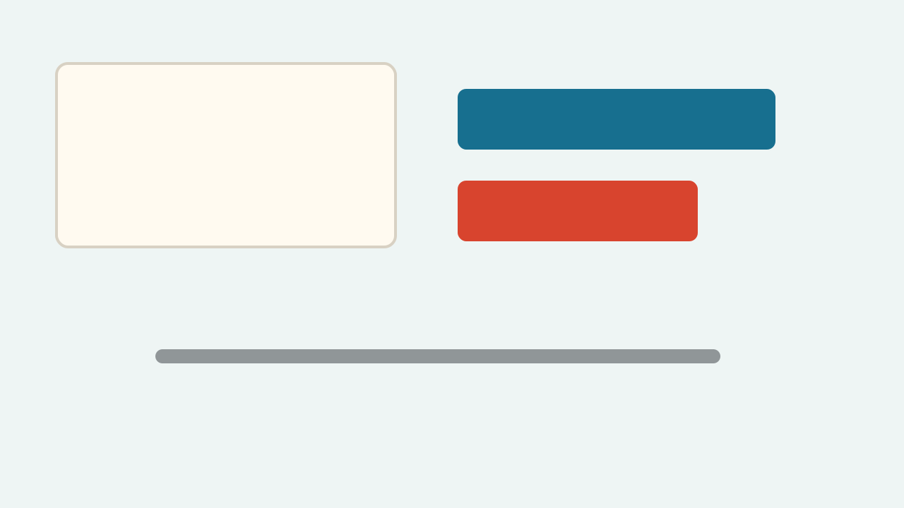

# Fixture Deck

<!-- slide: class=light -->

Opening slide for browser checks.

## Image Layout

<!-- slide: layout=image-right class=dark -->

- Image should load
- Split layout should be applied

## Two Column

<!-- slide: layout=two-col -->

Left column text

---

Right column text

## Full Image

<!-- slide: layout=full -->

## Compare

<!-- slide: layout=compare class=accent -->

| Item | Value |
| --- | --- |
| Slides | Working |
| Controls | Working |
